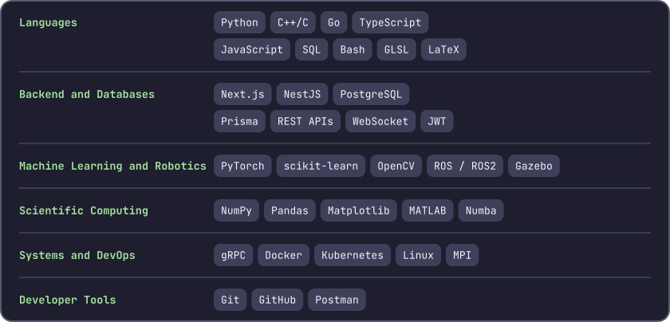
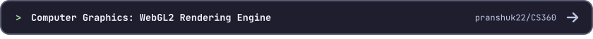
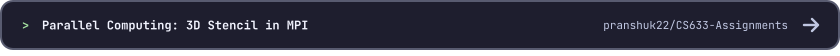
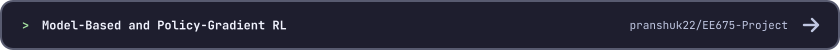
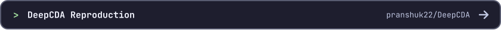
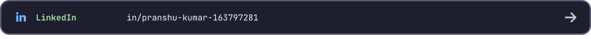
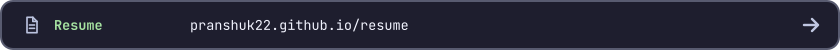

<picture>
  <source media="(prefers-color-scheme: dark)" srcset="assets/banner-dark.svg">
  <source media="(prefers-color-scheme: light)" srcset="assets/banner-light.svg">
  
</picture>

<a href="https://pranshuk22.github.io/"><picture><source media="(prefers-color-scheme: dark)" srcset="assets/chips/portfolio-dark.svg"><source media="(prefers-color-scheme: light)" srcset="assets/chips/portfolio-light.svg"></picture></a>&nbsp;<a href="https://pranshuk22.github.io/resume/"><picture><source media="(prefers-color-scheme: dark)" srcset="assets/chips/resume-dark.svg"><source media="(prefers-color-scheme: light)" srcset="assets/chips/resume-light.svg"></picture></a>&nbsp;<a href="https://www.linkedin.com/in/pranshu-kumar-163797281/"><picture><source media="(prefers-color-scheme: dark)" srcset="assets/chips/linkedin-dark.svg"><source media="(prefers-color-scheme: light)" srcset="assets/chips/linkedin-light.svg"></picture></a>&nbsp;<a href="mailto:pranshu23k@gmail.com"><picture><source media="(prefers-color-scheme: dark)" srcset="assets/chips/mail-dark.svg"><source media="(prefers-color-scheme: light)" srcset="assets/chips/mail-light.svg"></picture></a> 

Final-year undergraduate at **IIT Kanpur**, majoring in **Electrical Engineering** and **Chemical Engineering** with minors in **Machine Learning**, **Computer Systems** and **Management Sciences**.

I recently interned as a Software Engineer at **Samsara** (May to Jul 2026). My work spans full-stack engineering, systems programming, machine learning and robotics, with a growing interest in reinforcement learning. I enjoy turning complex technical problems into reliable, well-tested software.

<picture>
  <source media="(prefers-color-scheme: dark)" srcset="https://raw.githubusercontent.com/pranshuk22/pranshuk22/output/github-contribution-grid-snake-dark.svg">
  <source media="(prefers-color-scheme: light)" srcset="https://raw.githubusercontent.com/pranshuk22/pranshuk22/output/github-contribution-grid-snake.svg">
  
</picture>

## Tech Stack

<picture>
  <source media="(prefers-color-scheme: dark)" srcset="assets/tech-dark.svg">
  <source media="(prefers-color-scheme: light)" srcset="assets/tech-light.svg">
  
</picture>

## Projects

<a href="https://github.com/pranshuk22/CS360"><picture><source media="(prefers-color-scheme: dark)" srcset="assets/projects/project-1-dark.svg"><source media="(prefers-color-scheme: light)" srcset="assets/projects/project-1-light.svg"></picture></a>
<a href="https://github.com/pranshuk22/CS633-Assignments"><picture><source media="(prefers-color-scheme: dark)" srcset="assets/projects/project-2-dark.svg"><source media="(prefers-color-scheme: light)" srcset="assets/projects/project-2-light.svg"></picture></a>
<a href="https://github.com/pranshuk22/EE675-Project"><picture><source media="(prefers-color-scheme: dark)" srcset="assets/projects/project-3-dark.svg"><source media="(prefers-color-scheme: light)" srcset="assets/projects/project-3-light.svg"></picture></a>
<a href="https://github.com/pranshuk22/DeepCDA"><picture><source media="(prefers-color-scheme: dark)" srcset="assets/projects/project-4-dark.svg"><source media="(prefers-color-scheme: light)" srcset="assets/projects/project-4-light.svg"></picture></a>
<a href="https://pranshuk22.github.io/projects/"><picture><source media="(prefers-color-scheme: dark)" srcset="assets/projects/more-dark.svg"><source media="(prefers-color-scheme: light)" srcset="assets/projects/more-light.svg"></picture></a>

## Contact Me

<a href="https://pranshuk22.github.io/"><picture><source media="(prefers-color-scheme: dark)" srcset="assets/contact/portfolio-dark.svg"><source media="(prefers-color-scheme: light)" srcset="assets/contact/portfolio-light.svg"></picture></a>
<a href="https://www.linkedin.com/in/pranshu-kumar-163797281/"><picture><source media="(prefers-color-scheme: dark)" srcset="assets/contact/linkedin-dark.svg"><source media="(prefers-color-scheme: light)" srcset="assets/contact/linkedin-light.svg"></picture></a>
<a href="mailto:pranshu23k@gmail.com"><picture><source media="(prefers-color-scheme: dark)" srcset="assets/contact/mail-dark.svg"><source media="(prefers-color-scheme: light)" srcset="assets/contact/mail-light.svg"></picture></a>
<a href="https://pranshuk22.github.io/resume/"><picture><source media="(prefers-color-scheme: dark)" srcset="assets/contact/resume-dark.svg"><source media="(prefers-color-scheme: light)" srcset="assets/contact/resume-light.svg"></picture></a>
