**[Portfolio](https://pranshuk22.github.io/)** &nbsp;·&nbsp; **[Resume](https://pranshuk22.github.io/resume/)** &nbsp;·&nbsp; **[LinkedIn](https://www.linkedin.com/in/pranshu-kumar-163797281/)** &nbsp;·&nbsp; **[Codeforces](https://codeforces.com/profile/irrational_integer)** &nbsp;·&nbsp; **[Email](mailto:pranshu23k@gmail.com)**

 

Final-year undergraduate at **IIT Kanpur**, majoring in **Electrical Engineering** and **Chemical Engineering** with minors in **Machine Learning**, **Computer Systems** and **Management Sciences**.

I recently interned as a Software Engineer at **Samsara** (May to Jul 2026). My work spans full-stack engineering, systems programming, machine learning and robotics, with a growing interest in reinforcement learning. I enjoy turning complex technical problems into reliable, well-tested software.

<picture>
  <source media="(prefers-color-scheme: dark)" srcset="https://raw.githubusercontent.com/pranshuk22/pranshuk22/output/github-contribution-grid-snake-dark.svg">
  <source media="(prefers-color-scheme: light)" srcset="https://raw.githubusercontent.com/pranshuk22/pranshuk22/output/github-contribution-grid-snake.svg">
  
</picture>

## 🛠️ Tech stack

| Area | Tools |
| :--- | :--- |
| **Languages** | `Python` `C++/C` `Go` `TypeScript` `JavaScript` |
| **Backend and databases** | `Next.js` `NestJS` `PostgreSQL` `Prisma` |
| **Machine learning and robotics** | `PyTorch` `scikit-learn` `OpenCV` `ROS / ROS2` |
| **Scientific computing** | `NumPy` `Pandas` `Matplotlib` `MATLAB` |
| **Systems and DevOps** | `gRPC` `Docker` `Kubernetes` `Linux` |
| **Developer tools** | `Git` `GitHub` `Postman` `Bash` |

## 🚀 Selected projects

- **[Computer Graphics: WebGL2 Rendering Engine](https://github.com/pranshuk22/CS360)**
- **[Parallel Computing: 3D Stencil in MPI](https://github.com/pranshuk22/CS633-Assignments)**
- **[Model-Based and Policy-Gradient RL](https://github.com/pranshuk22/EE675-Project)**
- **[DeepCDA Reproduction](https://github.com/pranshuk22/DeepCDA)**

More on my [portfolio](https://pranshuk22.github.io/projects/).

## 📫 Find me

- [LinkedIn](https://www.linkedin.com/in/pranshu-kumar-163797281/)
- [Codeforces](https://codeforces.com/profile/irrational_integer) (Expert, peak rating 1608)
- [Email](mailto:pranshu23k@gmail.com)
- [Resume](https://pranshuk22.github.io/resume/)
